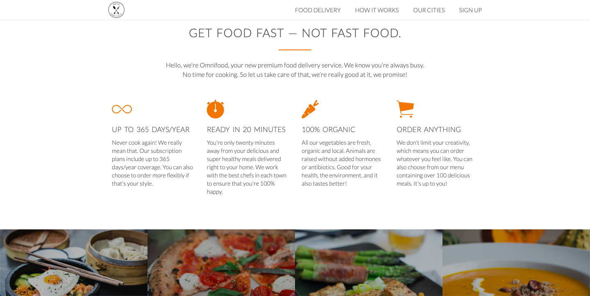
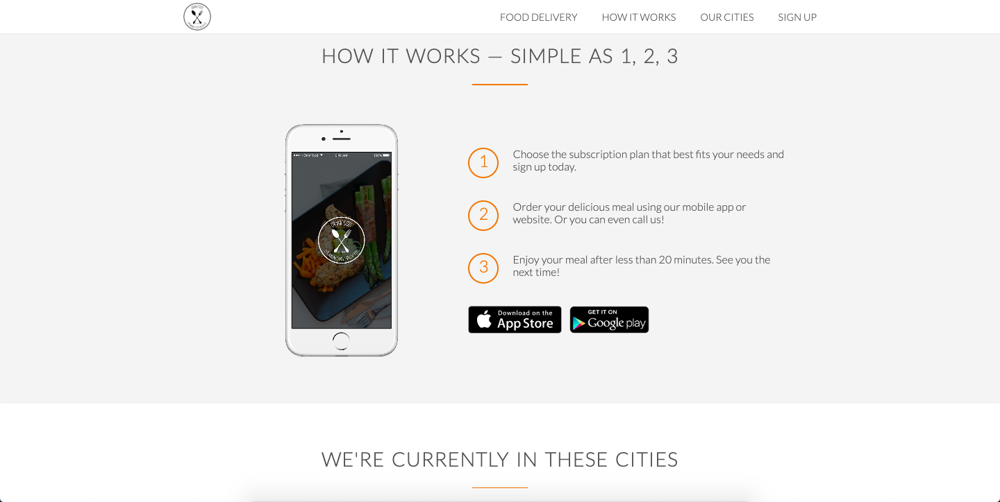
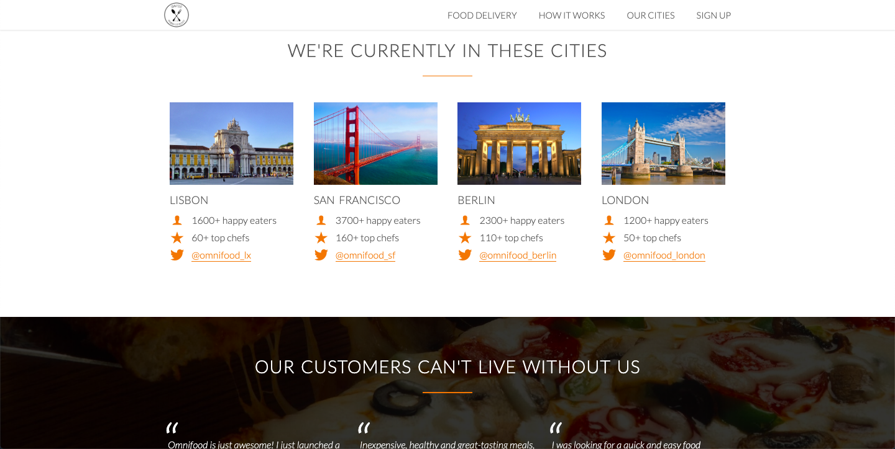
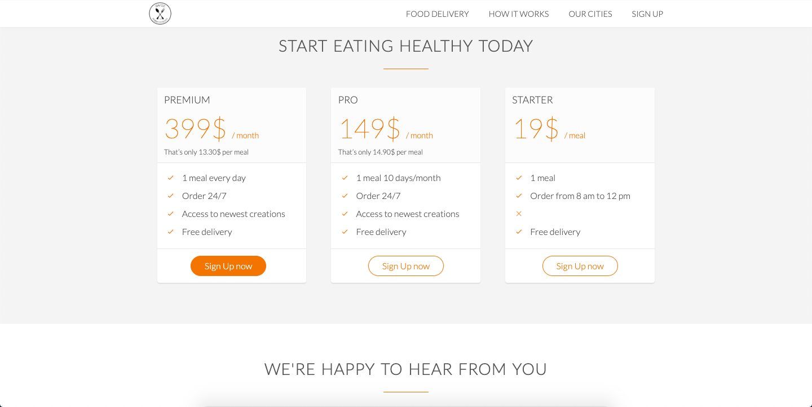

# omnifood

[Go To App](https://romansenin.github.io/omnifood)

## Project Description

Omnifood is a website for a fictitious food delivery company. As shown above, the user is initially presented with a stylish hero image of a nutritious meal and also two action buttons that grab the user's attention. Clicking these buttons, akin to the navbar buttons, takes the user further down the site to the relevant section.

There's the Food Delivery Section:

the How It Works Section:

the Our Cities Section:

and, last but not least, the Sign Up Section:

The gif below demonstrates how to navigate the site:

### Local Setup

1. Git clone or download zip folder.
1. Open the `./index.html` file in your preferred browser.

## Technologies

HTML5, CSS3, jQuery
